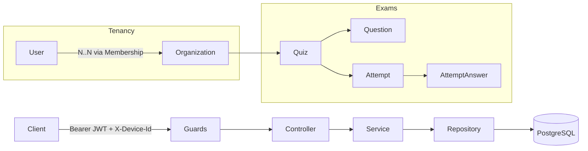

# Quorlyn

A multi-tenant examination platform for schools and classrooms: organizations,
teachers, students, and timed online exams with mixed Bangla/English questions
and LaTeX mathematics, chemistry and physics notation.

Built with NestJS, Prisma, and PostgreSQL.

## Why this project exists

This project demonstrates patterns that show up in real multi-tenant B2B
products, and a few that only show up when the software has to be *fair*:
tenant isolation, session and device lifecycle management, permission-scoped
authorization, server-authoritative timing, and answer-key confidentiality —
not just CRUD.

See [**Notable problems solved**](#notable-problems-solved) below for the specific
decisions worth reading.

## Tech stack

- **Framework:** NestJS 11 (Express)
- **Database:** PostgreSQL via Prisma ORM
- **Auth:** Passport-JWT access tokens + opaque, hashed, rotating refresh tokens, bound to a device
- **Validation:** class-validator DTOs + Zod for environment config
- **Question content:** UTF-8 (Bangla + English) with inline LaTeX — authored with [MathLive](https://mathlive.io/mathfield/), rendered with KaTeX + mhchem
- **Scheduling:** `@nestjs/schedule` for the attempt sweeper
- **Docs:** Swagger/OpenAPI (served at `/docs`)
- **Rate limiting:** `@nestjs/throttler`

## Architecture at a glance



Global guard order (registered in [src/app.module.ts](src/app.module.ts)):
`Throttler → JwtAuth → PlatformRoles → OrgContext → OrgRoles → Permissions`.
Routes opt out of auth with `@Public()`, and opt into gating with
`@PlatformRoles(...)`, `@OrgRoles(...)` or `@RequirePermissions(...)`. Full
request lifecycle: [docs/ARCHITECTURE.md](docs/ARCHITECTURE.md).

## Notable problems solved

- **One person, many organizations** — tenancy moved off the user row onto a
  `Membership` join model, so a student can sit exams at several schools (and
  a teacher can be a student elsewhere) under one login, with the active
  organization carried as an explicit token claim.
  → [ADR-0006](docs/adr/0006-membership-as-the-unit-of-tenancy.md),
  [ADR-0007](docs/adr/0007-active-organization-claim.md)
- **The exam clock is the server's** — deadlines are computed server-side and
  never renegotiated, answers autosave per question, and finalization runs
  both lazily on read *and* on a sweeper, so a wedged background job can never
  produce a stale score.
  → [ADR-0014](docs/adr/0014-attempt-lifecycle-and-timing.md),
  [ADR-0015](docs/adr/0015-auto-submission-and-cause.md)
- **The answer key is structurally absent from student responses** — separate
  repository `select` shapes, DTOs and routes rather than a filtered field, so
  the common "it's in the network tab" leak cannot be written by accident.
  → [ADR-0011](docs/adr/0011-answer-key-exposure-boundary.md)
- **Saying plainly what a backend cannot enforce** — "the student can't change
  tabs" is not implementable; the system records focus violations, acts on the
  count, and never claims to have locked anyone's device.
  → [ADR-0016](docs/adr/0016-focus-enforcement-is-client-side.md)
- **One active device per account, released by email** — sessions are bound to
  a device; signing in elsewhere returns a conflict and requires an emailed
  code, which makes account sharing visible instead of convenient.
  → [ADR-0017](docs/adr/0017-single-active-device.md)
- **Repository layer decoupling services from Prisma** — one repository per
  model, database-error translation in one place, and a transaction-runner
  abstraction so cross-model atomicity doesn't force every service to depend
  on Prisma's query API.
  → [ADR-0005](docs/adr/0005-repository-pattern-for-data-access.md)

The full decision log — twenty ADRs, with a requirement→decision map — is
indexed at [docs/adr/README.md](docs/adr/README.md).

## Getting started

```bash
pnpm install
cp .env.example .env   # fill in POSTGRES_URL, JWT_ACCESS_SECRET, SMTP_*, etc.

pnpm prisma:migrate    # apply migrations
pnpm db:seed           # create the superadmin from SUPERADMIN_EMAIL/PASSWORD

pnpm dev               # start in watch mode
```

The API listens on `PORT` (default `5000`). Interactive API docs are served at
`/docs` once the server is running.

### Useful scripts

| Command                | Purpose                                    |
| ----------------------- | ------------------------------------------- |
| `pnpm dev`               | Start with hot reload                       |
| `pnpm build`             | Compile via `tsconfig.build.json`           |
| `pnpm typecheck`         | Typecheck only, no emit                     |
| `pnpm test` / `test:e2e` | Unit / end-to-end tests                     |
| `pnpm prisma:migrate`    | Run Prisma migrations (dev)                 |
| `pnpm prisma:deploy`     | Apply migrations (prod)                     |
| `pnpm db:seed`           | Seed the superadmin user                    |
| `pnpm lint`              | ESLint with autofix                         |

## Roles and permissions

Platform authority lives on the user; organization authority lives on the
membership.

| Level | Value | Scope | Created via |
| --- | --- | --- | --- |
| `User.platformRole` | `SUPERADMIN` | Platform-wide, holds no membership | Seed script only |
| `User.platformRole` | `MEMBER` | Default for everyone else | Any signup path |
| `Membership.role` | `TEACHER` | One organization | Teacher invite |
| `Membership.role` | `STUDENT` | One organization | Join code, invite, or a quiz link |

Teachers additionally hold explicit permissions —
`MANAGE_MEMBERS`, `MANAGE_QUIZZES`, `VIEW_RESULTS`, `MANAGE_ORGANIZATION` —
granted per membership. Org owners hold all of them implicitly.

## Documentation

- [docs/ARCHITECTURE.md](docs/ARCHITECTURE.md) — auth flow, tenancy model, data model
- [docs/FRONTEND.md](docs/FRONTEND.md) — the client contract: auth flow, every endpoint, LaTeX/Bangla rendering, and the exam-runner rules
- [docs/adr/README.md](docs/adr/README.md) — index of every decision, the requirement→ADR map, and the build order
- [docs/adr/](docs/adr/) — Architecture Decision Records for non-obvious choices
- [docs/README.md](docs/README.md) — how this documentation set is organized and maintained
- [CLAUDE.md](CLAUDE.md) — the conventions and per-change checklist contributors and AI agents follow here
