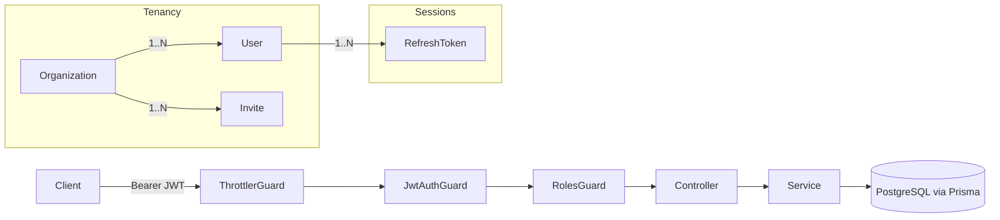

# Quorlyn

A multi-tenant SaaS backend for organizations (schools/classrooms) with role-based
access control, JWT auth with refresh-token rotation, and a dual onboarding flow
(admin-issued invites + self-serve join codes).

Built with NestJS, Prisma, and PostgreSQL.

## Why this project exists

This project is to demonstrate patterns that show up in real
multi-tenant B2B products: tenant isolation, session/token lifecycle management,
role-scoped authorization, and abuse-resistant onboarding — not just CRUD.

See [**Notable problems solved**](#notable-problems-solved) below for the specific
decisions worth reading.

## Tech stack

- **Framework:** NestJS 11 (Express)
- **Database:** PostgreSQL via Prisma ORM
- **Auth:** Passport-JWT (access tokens) + opaque, hashed, rotating refresh tokens
- **Validation:** class-validator DTOs + Zod for environment config
- **Docs:** Swagger/OpenAPI (served at `/docs`)
- **Rate limiting:** `@nestjs/throttler`

## Architecture at a glance



Global guard order (registered in [src/app.module.ts](src/app.module.ts)):
`ThrottlerGuard → JwtAuthGuard → RolesGuard`. Routes opt out of auth with
`@Public()` and opt into role checks with `@Roles(...)`. Full request lifecycle
is documented in [docs/ARCHITECTURE.md](docs/ARCHITECTURE.md).

## Notable problems solved

- **Refresh-token rotation with reuse detection** — refresh tokens are opaque,
  hashed at rest, and rotated on every use; replaying a token that's already
  been rotated revokes the entire session family instead of just failing.
  → [ADR-0001](docs/adr/0001-refresh-token-rotation.md)
- **Organization-scoped multi-tenancy on a single-schema model** — one `User`
  table serves a nullable-tenant superadmin alongside org-scoped
  teachers/students, with authorization enforced in guards/services rather
  than relying on row-level security.
  → [ADR-0002](docs/adr/0002-organization-scoped-multitenancy.md)
- **Dual onboarding paths** — admin-issued, single-use, expiring invites for
  teachers, and a public, collision-resistant join code for self-serve student
  signup, sharing one token/hashing primitive underneath.
  → [ADR-0003](docs/adr/0003-dual-onboarding-invite-and-join-code.md)
- **TypeScript project isolation across build/seed/app** — diagnosed and fixed
  a `rootDir` violation caused by the editor's default program pulling the
  Prisma seed script into the app's compile root.
  → [ADR-0004](docs/adr/0004-tsconfig-project-scoping.md)
- **Repository layer decoupling services from Prisma** — one repository per
  model, database-error translation centralized in one place, and a small
  transaction-runner abstraction so cross-model atomicity (org + owner
  invite, user create + invite accept) doesn't force every service to depend
  on Prisma's query API.
  → [ADR-0005](docs/adr/0005-repository-pattern-for-data-access.md)

## Getting started

```bash
pnpm install
cp .env.example .env   # fill in POSTGRES_URL, JWT_ACCESS_SECRET, SMTP_*, etc.

pnpm prisma:migrate    # apply migrations
pnpm db:seed           # create the superadmin from SUPERADMIN_EMAIL/PASSWORD

pnpm dev               # start in watch mode
```

The API listens on `PORT` (default `5000`). Interactive API docs are served at
`/docs` once the server is running.

### Useful scripts

| Command                | Purpose                                    |
| ----------------------- | ------------------------------------------- |
| `pnpm dev`               | Start with hot reload                       |
| `pnpm build`             | Compile via `tsconfig.build.json`           |
| `pnpm test` / `test:e2e` | Unit / end-to-end tests                     |
| `pnpm prisma:migrate`    | Run Prisma migrations (dev)                 |
| `pnpm prisma:deploy`     | Apply migrations (prod)                     |
| `pnpm db:seed`           | Seed the superadmin user                    |
| `pnpm lint`              | ESLint with autofix                         |

## Roles

| Role         | Scope                                    | Created via                          |
| ------------ | ----------------------------------------- | -------------------------------------- |
| `SUPERADMIN` | Platform-wide, `organizationId: null`     | Seed script only                       |
| `TEACHER`    | Scoped to one organization                | Accepting a teacher invite             |
| `STUDENT`    | Scoped to one organization                | Self-serve join code, or invite        |

## Documentation

- [docs/ARCHITECTURE.md](docs/ARCHITECTURE.md) — auth flow, tenancy model, data model
- [docs/adr/](docs/adr/) — Architecture Decision Records for non-obvious choices
- [docs/README.md](docs/README.md) — how this documentation set is organized and maintained
