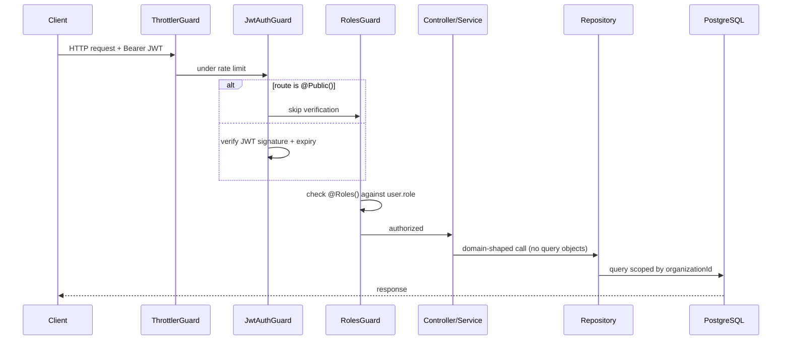
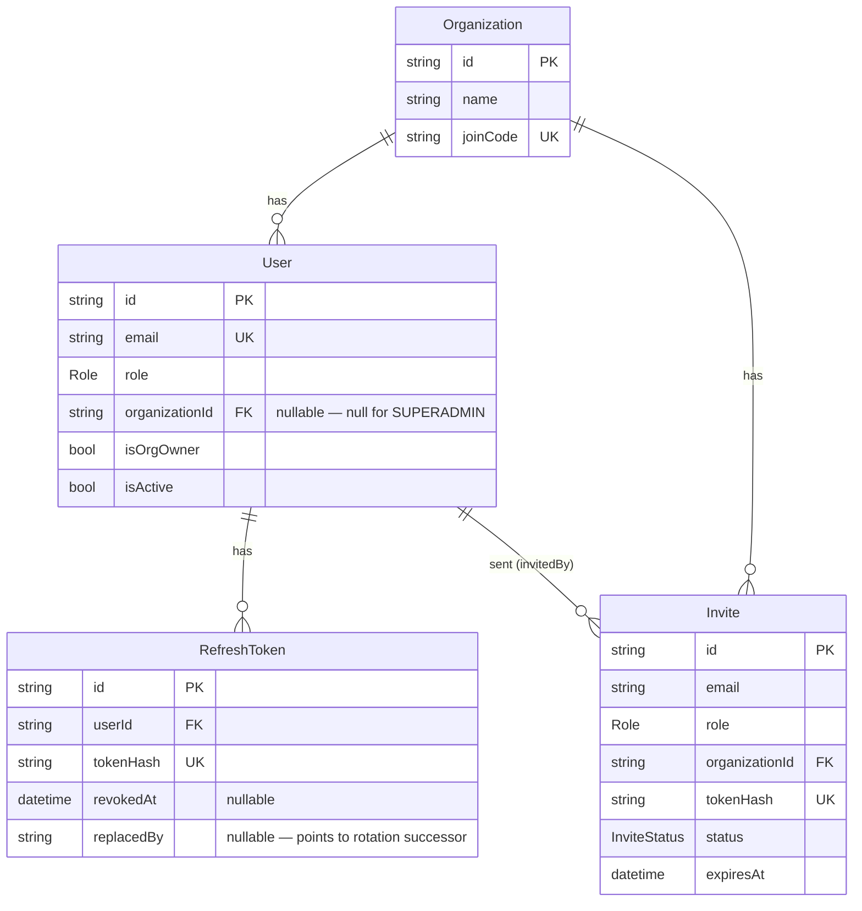

# Architecture

This document explains how requests flow through the system, how tenancy and
authorization are enforced, and how the core data model fits together. It's
the "how does this actually work" layer between the [README](../README.md)
(what/why, 30-second skim) and the [ADRs](adr/) (why a specific decision was
made, with alternatives).

## Request lifecycle

Every request passes through three global guards, registered in
[src/app.module.ts](../src/app.module.ts) in this order:

1. **`ThrottlerGuard`** — rate limits by IP (100 req/min default; auth's
   `login`/`refresh` endpoints override this to 5 req/min via `@Throttle`).
2. **`JwtAuthGuard`** ([src/common/guards/jwt-auth.guard.ts](../src/common/guards/jwt-auth.guard.ts)) —
   validates the bearer JWT via Passport's `jwt` strategy. Skipped entirely
   when the handler or controller is annotated `@Public()`.
3. **`RolesGuard`** ([src/common/guards/roles.guard.ts](../src/common/guards/roles.guard.ts)) —
   reads `@Roles(...)` metadata and checks it against `request.user.role`.
   No `@Roles()` on a route means any authenticated (or public) caller passes.

The JWT strategy ([src/module/auth/strategies/jwt.strategy.ts](../src/module/auth/strategies/jwt.strategy.ts))
is intentionally stateless: it trusts the signed payload (`sub`, `role`,
`organizationId`, `isOrgOwner`) for the token's short lifetime rather than
hitting the database on every request. The trade-off — a role change or
deactivation doesn't take effect until the access token expires — is accepted
because access tokens are short-lived (`JWT_ACCESS_TTL`, default 15m) and
refresh tokens are revocable. See [ADR-0001](adr/0001-refresh-token-rotation.md).

## Data access: repositories

Services never import `PrismaService` or build Prisma query objects. Each
model has a dedicated repository in
[src/common/repositories/](../src/common/repositories/) — `UserRepository`,
`OrganizationRepository`, `InviteRepository`, `RefreshTokenRepository` — and
services depend on those instead, calling methods named for the operation
(`findPendingByEmailAndOrg`, `findByTokenHashWithUser`) rather than the
underlying `where`/`include` shape.

Two flows need atomicity across more than one model —
`OrganizationsService.create` (org + owner invite) and
`InvitesService.acceptInvite` (user create + invite status update). Those
services inject `PrismaTransactionRunner`
([src/common/prisma/transaction-runner.ts](../src/common/prisma/transaction-runner.ts))
and pass it a callback; repository methods take an optional trailing `tx`
client so the same method works standalone or inside a transaction.
Single-model transactions (refresh-token rotation) stay entirely inside
their repository — `TokenService` never sees a transaction at all.

Database-specific error interpretation (Prisma's `P2002` unique-constraint
code) is centralized once in
[src/common/repositories/errors.ts](../src/common/repositories/errors.ts):
repositories throw a plain `UniqueConstraintViolationError`, and services
check `error.violates('email')` without knowing Prisma's error shape exists.

Full rationale, including the alternatives that were rejected (ambient
transactions, a generic base repository, a full unit-of-work object):
[ADR-0005](adr/0005-repository-pattern-for-data-access.md).

## Tenancy model

There is **one** `User` table for all three roles. Tenancy is expressed as a
nullable foreign key, not a separate schema or database per tenant:

- `SUPERADMIN` — `organizationId: null`, platform-wide access, created only
  by the seed script (never via a public endpoint).
- `TEACHER` / `STUDENT` — `organizationId` set, all access scoped to that
  organization.

Authorization is enforced in application code, not the database: services
that return org-scoped data (e.g. `OrganizationsService.findById`) explicitly
compare `currentUser.organizationId` against the resource before returning
it, and superadmin bypasses that check. See
[ADR-0002](adr/0002-organization-scoped-multitenancy.md) for why this was
chosen over per-tenant schemas or row-level security.

## Auth: tokens and sessions

- **Access token** — signed JWT, short-lived, stateless, carries role +
  tenant + org-owner flag.
- **Refresh token** — opaque random string, returned to the client once,
  never stored raw. The server stores only `sha256(token)` in
  `RefreshToken.tokenHash`.
- **Rotation** — every `refresh` call revokes the presented token and issues
  a new one (`TokenService.rotateRefreshToken`,
  [src/common/token/token.service.ts](../src/common/token/token.service.ts)).
  If a token that's already been rotated is presented again, every session
  for that user is revoked — this is the reuse-detection signal for token
  theft.
- **Logout** — `POST /auth/logout` revokes one refresh token;
  `POST /auth/logout-all` revokes every session for the current user.

Full rationale: [ADR-0001](adr/0001-refresh-token-rotation.md).

## Onboarding: invites and join codes

Two independent paths create org-scoped users, both funneling through the
same opaque-token/hash primitive (`generateOpaqueToken` / `hashToken` in
[src/common/utils/token.util.ts](../src/common/utils/token.util.ts)):

1. **Invite** ([src/module/invites/invites.service.ts](../src/module/invites/invites.service.ts)) —
   a `TEACHER` creates an invite for an email + role. State machine:
   `PENDING → ACCEPTED | EXPIRED | REVOKED`. The invite token is emailed, not
   returned in the API response. Accepting an invite creates the `User` and
   marks the invite `ACCEPTED` in one transaction.
2. **Join code** ([src/module/students/students.service.ts](../src/module/students/students.service.ts)) —
   each `Organization` has a public, 8-character, collision-resistant
   `joinCode` (ambiguous characters like `0/O/1/I/L` excluded). Any student
   with the code and an email can self-register, no invite needed.

Organization creation ([src/module/organizations/organizations.service.ts](../src/module/organizations/organizations.service.ts))
is superadmin-only and always creates an owner invite for the org's first
teacher in the same transaction as the org itself, retrying on join-code
collisions.

Full rationale: [ADR-0003](adr/0003-dual-onboarding-invite-and-join-code.md).

## Data model

Full schema: [prisma/schema.prisma](../prisma/schema.prisma).

## TypeScript project boundaries

Three separate `tsconfig`s exist because the app, the seed script, and the
editor's default program have different `rootDir`/`include` needs:

- [tsconfig.json](../tsconfig.json) — base config (editor + type-checking).
- [tsconfig.build.json](../tsconfig.build.json) — `nest build`, excludes
  `test`/`prisma`.
- [prisma/tsconfig.seed.json](../prisma/tsconfig.seed.json) — `ts-node`
  target for `pnpm db:seed`, roots at the repo root since `seed.ts` imports
  from `src/`.

Why this needed an explicit fix: [ADR-0004](adr/0004-tsconfig-project-scoping.md).
