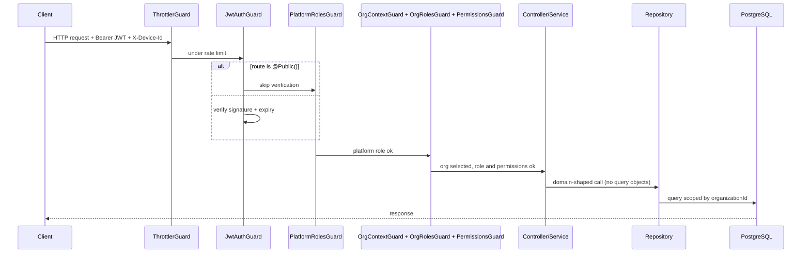
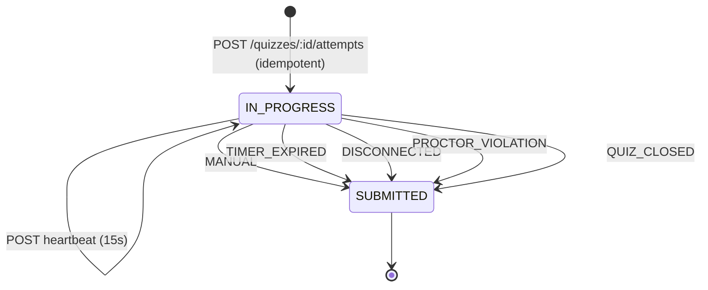
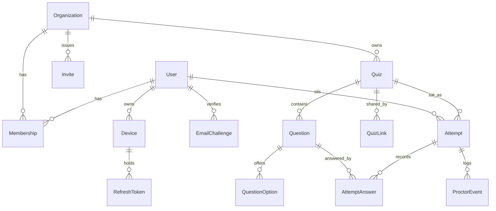

# Architecture

How requests flow through the system, how tenancy and authorization are
enforced, and how an exam actually runs. This is the "how does it work" layer
between the [README](../README.md) (what/why, 30-second skim) and the
[ADRs](adr/) (why a specific decision was made, with alternatives). The client
contract lives in [FRONTEND.md](FRONTEND.md).

## Request lifecycle

Six global guards, registered in [src/app.module.ts](../src/app.module.ts) in
this order:

1. **`ThrottlerGuard`** — 100 req/min per IP by default. Auth and other
   sensitive public endpoints tighten it with `@Throttle`; the exam's
   heartbeat and autosave opt out with `@SkipThrottle` because normal use
   exceeds any sane global limit.
2. **`JwtAuthGuard`** — validates the bearer JWT. Skipped for `@Public()`.
3. **`PlatformRolesGuard`** — `@PlatformRoles(PlatformRole.SUPERADMIN)`, the
   platform-wide gate, independent of any organization.
4. **`OrgContextGuard`** — requires an organization claim in the token. A
   route is org-scoped when it declares `@RequireOrg`, `@OrgRoles` or
   `@RequirePermissions`, so the requirement cannot be forgotten on a route
   that gates on either of the last two.
5. **`OrgRolesGuard`** — `@OrgRoles(OrgRole.TEACHER)` against the claim's role.
6. **`PermissionsGuard`** — `@RequirePermissions(...)`, satisfied by the
   superadmin, by an org owner implicitly, or by explicit grants.

The JWT strategy ([jwt.strategy.ts](../src/module/auth/strategies/jwt.strategy.ts))
is stateless: it trusts the signed payload for the token's short life rather
than hitting the database per request. The payload carries `sub`,
`platformRole`, `deviceId`, and an `org` claim (`id`, `role`, `isOrgOwner`,
`permissions`) or `null`. The accepted cost is staleness — a demotion or
suspension takes effect at the next refresh, within `JWT_ACCESS_TTL` — so
anything that must apply immediately also revokes refresh tokens. See
[ADR-0001](adr/0001-refresh-token-rotation.md),
[ADR-0007](adr/0007-active-organization-claim.md),
[ADR-0008](adr/0008-organization-permissions.md).

## Tenancy

A person belongs to many organizations. `Membership` — not `User` — is the
unit of tenancy ([ADR-0006](adr/0006-membership-as-the-unit-of-tenancy.md)):

- `User` holds identity, credentials, `platformRole`, and whether the account
  is device-locked. No `organizationId`, no org role.
- `Membership(userId, organizationId, role, isOrgOwner, permissions[], status)`
  holds everything org-scoped, unique per `(user, organization)`.
- `SUPERADMIN` is `User.platformRole` and holds no membership. It may select
  any organization and acts with owner-equivalent authority; the claim is
  synthesised in
  [org-claim.service.ts](../src/common/token/org-claim.service.ts).

Every org-scoped query filters on `organizationId` **in the query**, never
fetch-then-compare. `Attempt` carries a denormalized `organizationId` so
dashboards and leaderboards stay single-table.

Selecting an organization (`POST /auth/organizations/:id/select`) re-signs the
access token only. The refresh token is scoped to a user and a device, so
switching organizations never touches the session.

## Sessions and devices

- **Access token** — signed JWT, short-lived, carries the org claim.
- **Refresh token** — opaque, stored only as `sha256`, rotated on every use;
  replaying a rotated token revokes the whole family
  ([ADR-0001](adr/0001-refresh-token-rotation.md)).
- **Device binding** — refresh tokens hang off a `Device` row keyed by
  `sha256(X-Device-Id)`. Accounts with `singleDeviceEnforced` (students by
  default) may hold one live session: logging in elsewhere returns
  `409 DEVICE_CONFLICT`, and moving the session requires an emailed six-digit
  code, after which every other session and device is revoked
  ([ADR-0017](adr/0017-single-active-device.md)).

All of it funnels through
[SessionService](../src/common/session/session.service.ts) — login, invite
acceptance and join-code signup create a session the same way, so device
binding and organization pre-selection cannot drift apart.

## Onboarding

Three ways into an organization, all creating a `Membership`:

1. **Invite** — per-email opaque token, `PENDING → ACCEPTED | EXPIRED |
   REVOKED`, single or batched up to 100 with per-recipient outcomes
   ([ADR-0009](adr/0009-batch-invitations.md)). Accepting with an email that
   already has an account adds a membership to it rather than failing.
2. **Join code** — the organization's public 8-character code
   ([ADR-0003](adr/0003-dual-onboarding-invite-and-join-code.md)), rotatable
   when it leaks.
3. **Quiz link** — a revocable per-share token; taking one enrols the student
   as a side effect of sitting the exam
   ([ADR-0013](adr/0013-quiz-links-and-self-enrolment.md)).

## Quiz authoring

`Quiz → Question → QuestionOption`, with a one-way lifecycle
`DRAFT → PUBLISHED → CLOSED → ARCHIVED`
([ADR-0010](adr/0010-quiz-authoring-model.md)). Publishing validates the whole
quiz once, so the exam runtime can assume it is well-formed; after that the
questions, points, duration and attempt policy are **immutable** and the way
to change them is `POST /quizzes/:id/duplicate`.

Question and option content is UTF-8 text — Bangla and English freely mixed —
with mathematics as inline LaTeX between `$…$` / `$$…$$`, including mhchem
`\ce{}` for chemistry ([ADR-0020](adr/0020-question-content-storage.md)).
[content.util.ts](../src/common/content/content.util.ts) validates it and
never rewrites it: unbalanced delimiters, HTML, and non-mathematical LaTeX
commands are rejected, because silently altering a formula changes the exam.

The answer key never enters a student-facing path
([ADR-0011](adr/0011-answer-key-exposure-boundary.md)). That is enforced
structurally, not by filtering: `QuestionRepository.findManyForExam` uses a
`select` that omits `isCorrect` entirely, `findManyWithAnswerKey` is a
separate method, and the two have separate DTOs and separate routes. There is
no shared mapper with an `includeAnswers` flag.

## Sitting an exam

The server owns the clock ([ADR-0014](adr/0014-attempt-lifecycle-and-timing.md)).
`deadlineAt = min(startedAt + durationSeconds, closesAt)` is computed at start
and never renegotiated; no endpoint accepts an elapsed time, a client deadline,
or a client event timestamp. Starting is idempotent — an in-progress attempt is
resumed, not duplicated — and answers autosave one at a time, which is what
makes a disconnect survivable.

Finalization happens two ways and both produce the same result
([ADR-0015](adr/0015-auto-submission-and-cause.md)):

- **Lazily**, via `AttemptFinalizerService.finalizeIfDue` on every read path,
  so no query can observe a stale `IN_PROGRESS`.
- **Eagerly**, via [AttemptSweeperService](../src/module/attempts/attempt-sweeper.service.ts)
  every 30 seconds, so leaderboards settle without anyone looking.

Both go through one conditional update (`updateMany where status =
IN_PROGRESS`) inside the grading transaction, so a manual submit racing the
sweeper grades exactly once, and the sweeper is safe to run on every instance.
Grading is one pass over the answer key at finalization, dispatched per
question type through [graders](../src/common/exam/graders/) registered in a
map — a new question type is a new class, not a new `switch` branch.

Tab and focus lockdown is **not** enforceable server-side
([ADR-0016](adr/0016-focus-enforcement-is-client-side.md)). The client attempts
it and reports events; the server stamps its own time, counts the ones that
matter, and auto-submits past `maxFocusViolations`. Events are evidence for a
human and never a grading input.

## Results

One row per student on a leaderboard, chosen by the quiz's `scoringPolicy`
(`BEST`/`FIRST`/`LATEST`) and ranked `score DESC, duration ASC, submittedAt
ASC` ([ADR-0018](adr/0018-scoring-and-leaderboards.md)). Prisma has no window
functions, so this is the one sanctioned drop to `$queryRaw` — confined to
`AttemptRepository.leaderboard`, behind a typed method, with no service ever
seeing SQL.

Dashboards aggregate on read, scoped to one organization and one time window,
with no counters maintained on write
([ADR-0019](adr/0019-dashboard-read-models.md)). The written trigger for
revisiting that is a p95 above ~300ms on real data.

## Data access: repositories

Services never import `PrismaService` or build Prisma query objects
([ADR-0005](adr/0005-repository-pattern-for-data-access.md)). Each model has a
repository in [src/common/repositories/](../src/common/repositories/) exposing
methods named for the operation (`findPendingByEmailAndOrg`,
`findDueForFinalization`), and database-error interpretation is centralized in
[errors.ts](../src/common/repositories/errors.ts).

Single-model atomicity stays inside the repository
(`RefreshTokenRepository.rotate`). Cross-model atomicity uses
`PrismaTransactionRunner.run(cb)` with an optional trailing `tx` on repository
methods — organization creation, invite acceptance, attempt start, grading,
and device change all use it.

Timing is injected, not read statically: everything that asks "what time is
it" depends on [`Clock`](../src/common/clock/clock.ts), so exam timing is
deterministic under test.

## Data model

Full schema: [prisma/schema.prisma](../prisma/schema.prisma).

## TypeScript project boundaries

Three `tsconfig`s, because the app, the seed script and the editor's default
program have different `rootDir`/`include` needs
([ADR-0004](adr/0004-tsconfig-project-scoping.md)):
[tsconfig.json](../tsconfig.json) (editor/type-checking),
[tsconfig.build.json](../tsconfig.build.json) (`nest build`, also used by
`pnpm typecheck`), and
[prisma/tsconfig.seed.json](../prisma/tsconfig.seed.json) (`pnpm db:seed`).
