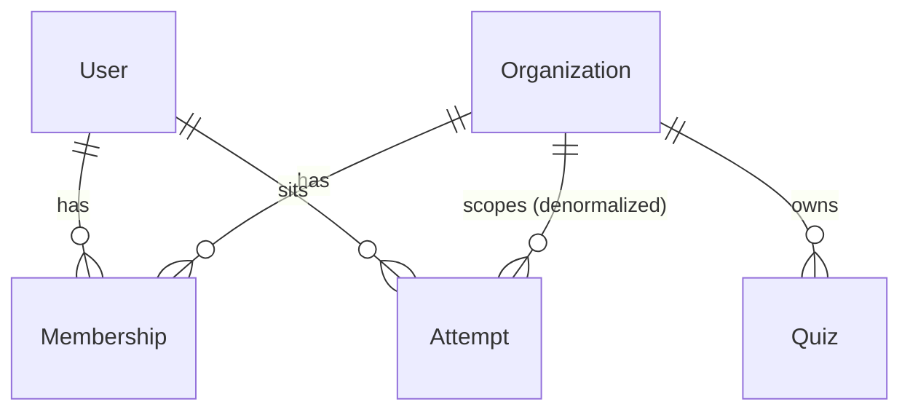

# ADR-0006: `Membership` as the unit of tenancy (users belong to many organizations)

- **Status:** Accepted
- **Date:** 2026-08-23

## Context

[ADR-0002](0002-organization-scoped-multitenancy.md) put tenancy on the user
row: one `Role` and one nullable `organizationId` per `User`. That holds
exactly as long as a person belongs to at most one organization.

The quiz requirements break that assumption in two places:

- *"Student can attend exam in multiple organization"* — one person, one set
  of credentials, several organizations, with progress tracked separately in
  each.
- A teacher in one organization may legitimately sit an exam as a student in
  another; nothing in the product forbids it, and the current model can't
  express it at all.

The email column is `@unique`, so "one user row per organization" isn't
available without giving the same human two accounts and two passwords. And
`Role` on the user row is now ambiguous: a person is not globally a teacher,
they are a teacher *of an organization*.

## Decision

Move the org relationship, the org role, and the ownership flag off `User`
and into a join model. `User` keeps only what is true platform-wide:
identity, credentials, and whether they are the platform superadmin.

```prisma
enum PlatformRole {
  SUPERADMIN
  MEMBER
}

enum OrgRole {
  TEACHER
  STUDENT
}

enum MembershipStatus {
  ACTIVE
  SUSPENDED
}

model User {
  id           String       @id @default(cuid())
  email        String       @unique
  passwordHash String
  platformRole PlatformRole @default(MEMBER)
  isActive     Boolean      @default(true)
  // organizationId, role, isOrgOwner removed — see Membership
  memberships  Membership[]
}

model Membership {
  id             String           @id @default(cuid())
  userId         String
  organizationId String
  role           OrgRole
  isOrgOwner     Boolean          @default(false)
  status         MembershipStatus @default(ACTIVE)
  permissions    Permission[]     // see ADR-0008
  joinedAt       DateTime         @default(now())

  user         User         @relation(fields: [userId], references: [id], onDelete: Cascade)
  organization Organization @relation(fields: [organizationId], references: [id])

  @@unique([userId, organizationId])
  @@index([organizationId, role])
  @@index([userId])
}
```



Consequences for the layers above:

- **A person has at most one membership per organization** (`@@unique`), so
  "teacher and student in the same org" is structurally impossible — the
  ambiguity that would otherwise need a runtime rule.
- **Every org-scoped query filters on `Membership.organizationId`**, not
  `User.organizationId`. The tenancy rule from ADR-0002 is unchanged in
  spirit: filter in the query, never fetch-then-compare.
- **`SUPERADMIN` is no longer an `OrgRole`.** It lives on `User.platformRole`
  and holds no membership, which removes the "role enum that a client must
  never be allowed to request" problem at its root — `OrgRole` simply has no
  superadmin value to request (compare the `InvitableRole` workaround in
  [create-invite.dto.ts](../../src/module/invites/dto/create-invite.dto.ts)).
- **`Invite.role` becomes `OrgRole`**, and accepting an invite creates a
  `Membership` rather than setting fields on the new user. If the invited
  email already has an account, acceptance adds a membership to the existing
  user instead of failing with "email already exists" — which is precisely
  the multi-org case the requirement asks for.
- The join-code flow ([ADR-0003](0003-dual-onboarding-invite-and-join-code.md))
  behaves the same way: it creates a `STUDENT` membership, creating the user
  first only if the email is new.

## Alternatives considered

- **Keep `User.organizationId` as a "home org" and add a separate
  `Enrollment` table for students only** — smaller migration, and teachers
  keep working unchanged. Rejected because it encodes two different tenancy
  mechanisms for the same concept: every org-scoped query would need to know
  whether the subject is a teacher (look at `User`) or a student (look at
  `Enrollment`), and a teacher who is a student elsewhere still has no home.
  The duplication would land in every dashboard and leaderboard query.
- **One user row per organization, dropping `email @unique` in favour of
  `@@unique([email, organizationId])`** — avoids a join table entirely.
  Rejected: it multiplies credentials (a password reset per organization),
  breaks login, which happens *before* any organization is known, and makes
  "the same student across two schools" invisible to the platform.
- **Keep the role on `User` and let the same person be only one kind of
  thing platform-wide** — the cheapest option. Rejected because it doesn't
  satisfy the requirement, only postpones it, and the migration gets more
  expensive with every table that gains an `organizationId`.

## Consequences

- **This supersedes the user↔organization part of ADR-0002.** Its other
  decisions — single schema, single database, isolation enforced in
  application code rather than row-level security — carry forward unchanged.
  ADR-0002's status line now reads `Superseded by ADR-0006`.
- **The migration is not additive.** It runs in three steps: create
  `Membership`; backfill one row per user with a non-null `organizationId`
  (carrying `role`, `isOrgOwner`) and set `platformRole = SUPERADMIN` for the
  rows with `organizationId: null`; then drop the three columns from `User`.
  Steps 1–2 must be deployed and verified before step 3.
- **Authorization now needs two facts, not one:** who the caller is, and
  which organization they are acting in. That second fact has to come from
  somewhere on every request — see [ADR-0007](0007-active-organization-claim.md).
- A user with zero memberships is now a valid state (a registered person not
  yet in any organization). Every org-scoped endpoint must handle it as
  "forbidden", not as an impossible case.
- `UserRepository` grows a `MembershipRepository` sibling rather than absorbing
  the queries: memberships are looked up by `(userId, organizationId)` and
  listed per organization, and neither is a user query.
