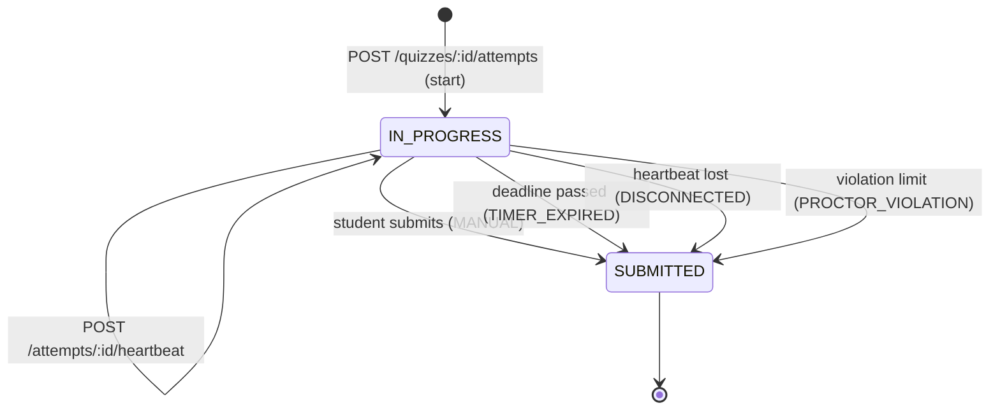

# ADR-0014: The attempt is a server-authoritative state machine; the client never owns the clock

- **Status:** Accepted
- **Date:** 2026-08-23

## Context

*"Student … start exam with timer"*, and the timer is the thing under attack.
Every naive implementation puts the countdown in the browser and trusts what
comes back: elapsed seconds in the submit payload, a `startedAt` the client
sends, a deadline computed in JavaScript. All of them are editable by the
person being timed.

The second problem is interruption. Exams are taken on flaky campus wifi and
shared laptops. Losing a connection mid-exam must not lose the answers
already given, and reconnecting must not restart the clock — either failure
turns a network blip into an academic dispute.

Both problems land on the same object: what an "attempt" is, who may change
it, and when.

## Decision

An `Attempt` row is the single source of truth for one sitting, and every
timestamp on it is written by the server from the server's clock.

```prisma
enum AttemptStatus { IN_PROGRESS SUBMITTED }

model Attempt {
  id             String        @id @default(cuid())
  quizId         String
  userId         String
  organizationId String                      // denormalized for tenant-scoped queries
  attemptNumber  Int
  status         AttemptStatus @default(IN_PROGRESS)
  startedAt      DateTime      @default(now())
  deadlineAt     DateTime                    // computed at start — ADR-0012
  submittedAt    DateTime?
  submissionCause SubmissionCause?           // ADR-0015
  lastHeartbeatAt DateTime     @default(now())
  score          Int?
  maxScore       Int                         // Quiz.totalPoints, frozen at start
  deviceId       String?                     // ADR-0017
  ipAddress      String?
  userAgent      String?

  answers AttemptAnswer[]
  events  ProctorEvent[]                     // ADR-0016

  @@unique([quizId, userId, attemptNumber])
  @@index([quizId, status])
  @@index([userId, quizId])
  @@index([status, deadlineAt])              // the finalizer's sweep
}

model AttemptAnswer {
  id                String   @id @default(cuid())
  attemptId         String
  questionId        String
  selectedOptionIds String[]                 // empty array = explicitly skipped
  answeredAt        DateTime @updatedAt
  isCorrect         Boolean?                 // written at grading, never sent to the student
  pointsAwarded     Int?

  @@unique([attemptId, questionId])
  @@index([attemptId])
}
```



Four rules make it work:

1. **Starting is idempotent.** `POST /quizzes/:id/attempts` returns the
   caller's existing `IN_PROGRESS` attempt if there is one, rather than
   creating a second. A reconnecting student resumes; they do not consume
   another allowance and they do not get a fresh clock. Only when no
   in-progress attempt exists does the eligibility check
   ([ADR-0012](0012-availability-window-and-attempt-policy.md)) run and a new
   row get created, inside a transaction that also increments
   `attemptNumber` from the existing count.
2. **`deadlineAt` is computed once, server-side, and never re-negotiated.**
   Every response that matters (`start`, `heartbeat`, each answer save)
   returns `{ serverTime, deadlineAt }`. The browser countdown is a rendering
   of that difference and carries no authority; a client with a skewed or
   frozen clock simply displays the wrong number while the server enforces
   the right one.
3. **Answers autosave one at a time.** `PUT /attempts/:id/answers/:questionId`
   upserts a single answer and is rejected with `410 Gone` once
   `now > deadlineAt` or the attempt is `SUBMITTED`. There is no "submit
   everything at the end" payload to lose, which is what makes disconnect
   recovery cheap: the answers are already on the server.
4. **Grading happens at finalization, in one pass, inside a transaction.**
   The service reads the answer key ([ADR-0011](0011-answer-key-exposure-boundary.md)),
   writes `isCorrect`/`pointsAwarded` per answer and `score` on the attempt,
   and flips the status — via a conditional update
   (`updateMany where status = IN_PROGRESS`) so that a manual submit racing
   the auto-finalizer produces exactly one result, not two.

Scoring is all-or-nothing per question: a `MULTI_CHOICE` answer earns
`points` only if the selected set equals the correct set. Partial credit is a
scoring-policy decision that would need its own ADR; guessing every option
must never beat answering correctly.

## Alternatives considered

- **Client sends elapsed time or the full answer set at submit** — one
  endpoint, no autosave traffic, no server timers. Rejected: the timer is
  forgeable and a disconnect loses the whole sitting. This is the design the
  requirement is written against.
- **Server-side session state in memory (or Redis) instead of a row per
  attempt** — faster writes, natural TTL. Rejected: attempts *are* the
  academic record; they must survive a restart, be queryable for
  leaderboards, and be auditable months later. A cache in front of the row is
  a later optimization, not the store.
- **A single `answers` JSON column on the attempt** — fewer rows, one write.
  Rejected: per-question stats for the teacher dashboard
  ([ADR-0019](0019-dashboard-read-models.md)) need to aggregate across
  students by question, which a JSON blob turns into a full scan, and
  concurrent autosaves of one blob overwrite each other.
- **`EXPIRED` as a distinct terminal status** alongside `SUBMITTED` —
  rejected in favour of `SUBMITTED` + `submissionCause`: every finalized
  attempt has a score and belongs in the same queries, and *why* it ended is
  a separate axis from *whether* it ended. See
  [ADR-0015](0015-auto-submission-and-cause.md).

## Consequences

- The server writes on every answer and every heartbeat, so an exam with 200
  concurrent students is a write-heavy workload on two tables. The indexes
  above are chosen for that, and heartbeat is deliberately a narrow
  `updateMany` on one column rather than a read-modify-write.
- `maxScore` is copied onto the attempt at start. Quizzes are immutable once
  published (ADR-0010), so this is belt-and-braces — but it means a
  historical attempt still renders correctly even if that guarantee is ever
  relaxed.
- `organizationId` on the attempt is denormalized from the quiz. It is
  redundant, and it is what keeps every dashboard and leaderboard query a
  single-table filter instead of a join through `Quiz` on the hottest read
  path in the product.
- An attempt is bound to the device that started it (`deviceId`,
  [ADR-0017](0017-single-active-device.md)); resuming from a different device
  is permitted — that is disconnect recovery — but it is recorded as a
  proctor event rather than passing silently.
