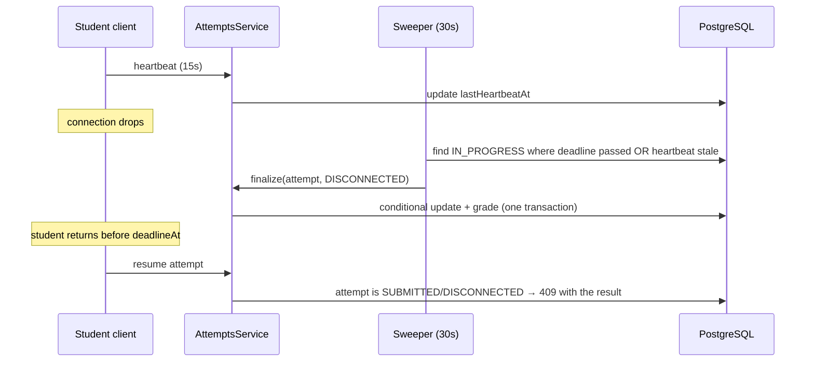

# ADR-0015: Lazy finalization plus a sweeper, and every submission records its cause

- **Status:** Accepted
- **Date:** 2026-08-23

## Context

*"When time is up or disconnect then auto submit and cause of submit will be
recorded too."*

Two halves, both awkward. "Time is up" is easy to check when someone asks and
impossible to notice on its own — no request arrives at the deadline of an
abandoned attempt. "Disconnect" is worse: a browser that vanishes sends
nothing, and TCP tells the server nothing useful either. The server can only
infer absence from silence, which means choosing how long silence has to last
before it counts.

And the answer must be right in three places at once: the student's screen,
the teacher's live view, and the leaderboard. An attempt whose deadline
passed twenty minutes ago must not still read `IN_PROGRESS` because a
background job is wedged.

## Decision

**Detection is a heartbeat.** The exam client `POST`s
`/attempts/:id/heartbeat` every 15 seconds; the server stamps
`lastHeartbeatAt` and replies with `{ serverTime, deadlineAt, remainingMs }`.
Silence longer than `HEARTBEAT_GRACE_SECONDS` (default 90 — six missed beats,
enough to ride out a lift or a wifi handover) counts as a disconnect.

**Finalization happens two ways, and both produce the same result.**

- *Lazily, on read.* Any request that touches an attempt — the student
  resuming, the teacher opening the results view, the leaderboard query —
  first runs `finalizeIfDue(attempt)`. If the deadline has passed or the
  heartbeat has gone stale, the attempt is finalized there and then, before
  the caller sees it. **No read can observe a stale `IN_PROGRESS`.**
- *Eagerly, on a schedule.* A sweeper (`@nestjs/schedule`, every 30 seconds)
  finalizes due attempts in batches, so leaderboards and dashboards settle
  without anyone opening them.

The sweeper is an optimization, not a correctness requirement. If it stops,
data stays correct — it just settles later, on first read. That is the whole
reason for doing both: a design that depends only on a cron job is one failed
deploy away from wrong scores, and a design that depends only on lazy reads
leaves the leaderboard stale until someone looks.

**Finalization is idempotent by construction.** It is a conditional update —
`updateMany({ where: { id, status: IN_PROGRESS }, data: { … } })` — inside
the grading transaction ([ADR-0014](0014-attempt-lifecycle-and-timing.md)).
Zero rows affected means someone else finalized it first; the caller re-reads
and returns their result. A manual submit racing the sweeper, or two app
instances sweeping at once, cannot double-grade or double-count.

**Cause is a first-class field**, not an inference from timestamps:

```prisma
enum SubmissionCause {
  MANUAL             // the student pressed submit
  TIMER_EXPIRED      // now > deadlineAt
  DISCONNECTED       // heartbeat silent past the grace period
  PROCTOR_VIOLATION  // focus-rule limit exceeded — ADR-0016
  QUIZ_CLOSED        // teacher closed the quiz with attempts in flight
  ADMIN_CLOSED       // staff intervention
}
```

Every finalization sets it, including `MANUAL`, so the field is never null on
a `SUBMITTED` attempt and no reader has to reconstruct intent by comparing
`submittedAt` to `deadlineAt`. The cause is shown to the teacher next to the
score and to the student on their own attempt — a student who was cut off
deserves to know the system knows.



A student who reconnects *before* the grace period elapses simply keeps
going — nothing was finalized. A student who reconnects after it, but before
the deadline, finds the attempt closed. That is harsh, and it is deliberate:
the alternative — reopening a finalized attempt — means a submitted score can
change, which breaks the leaderboard's meaning and hands anyone a way to buy
thinking time by pulling the network cable. `HEARTBEAT_GRACE_SECONDS` is the
dial for how forgiving that is, and it is configuration, not code.

## Alternatives considered

- **Sweeper only** — one implementation, one code path. Rejected: a stalled
  worker silently produces wrong live data, and there is no single instance
  in a horizontally scaled deploy that can be trusted to have run.
- **Lazy finalization only** — no scheduler, no new dependency, correct by
  construction. Rejected as the whole answer: the teacher's leaderboard is
  the main consumer, and it would show the previous state until refreshed by
  someone who happened to touch each attempt.
- **WebSocket connection state as the disconnect signal** — a real socket
  close is a stronger signal than missing heartbeats. Rejected for now: it
  adds a stateful transport and sticky sessions to a stateless HTTP API for a
  signal that is still unreliable (a suspended laptop's socket may stay open
  for minutes). Heartbeats over plain HTTP degrade gracefully and are
  testable with `curl`.
- **Reopening an attempt on reconnect within the deadline** — kinder to the
  student. Rejected: see above; it makes a finalized score mutable and turns
  disconnection into a strategy.
- **Inferring cause from timestamps at read time** (`submittedAt >= deadlineAt`
  ⇒ expired) — no enum, no migration. Rejected: it cannot distinguish a
  disconnect from a timeout at all, and the requirement asks for the cause to
  be *recorded*, not guessed.

## Consequences

- `@nestjs/schedule` becomes a dependency, and the sweeper must be safe to
  run on every instance simultaneously — which the conditional update already
  guarantees. No leader election, no distributed lock.
- The sweep query is `WHERE status = 'IN_PROGRESS' AND (deadlineAt <= now()
  OR lastHeartbeatAt < now() - grace)`, served by
  `@@index([status, deadlineAt])`. It is bounded (`take`) per tick so a
  backlog can never turn one tick into a long transaction.
- Heartbeats are the highest-frequency write in the system: one row, one
  column, every 15 seconds per active student. It is a narrow `updateMany`
  by primary key for that reason, and it is exempt from the default
  throttler, which would otherwise reject it under normal use.
- `finalizeIfDue` sits on the read path of the hottest queries, so it must be
  a no-op fast path — a timestamp comparison on already-loaded rows, not an
  extra query — with the write happening only when something is actually due.
- The client should call heartbeat on `visibilitychange` and on regaining
  focus as well as on the interval; browsers throttle timers in background
  tabs, and a student who is merely on another tab should not be scored as
  disconnected. That interacts directly with
  [ADR-0016](0016-focus-enforcement-is-client-side.md).
