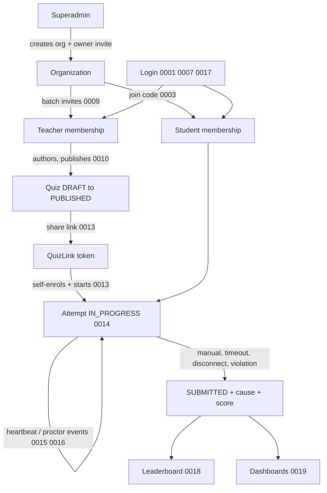

# Decision log

Every non-obvious choice in this codebase is recorded here as an ADR. This
index exists because there are now enough of them to need a map; the ADRs
themselves are the record, and this file only points at them.

**Status means what it says.** `Accepted` ADRs describe code that exists in
`main`; `Proposed` would mean a decision taken for work not yet built. Every
ADR below is `Accepted` — the quiz platform (0006–0020) was designed first and
then implemented, and each ADR's status flipped in the change that built it.

Writing conventions, and when an ADR is warranted at all:
[docs/README.md](../README.md).

## Foundations

| ADR | Decision |
| --- | --- |
| [0001](0001-refresh-token-rotation.md) | Opaque, hashed, rotating refresh tokens with reuse detection |
| [0002](0002-organization-scoped-multitenancy.md) | Single-schema multi-tenancy via nullable `organizationId` — **superseded by [0006](0006-membership-as-the-unit-of-tenancy.md)**; its single-schema and app-level-authorization decisions carry forward |
| [0003](0003-dual-onboarding-invite-and-join-code.md) | Dual onboarding: per-email invites and a public join code |
| [0004](0004-tsconfig-project-scoping.md) | Separate TypeScript projects for app, build, and seed |
| [0005](0005-repository-pattern-for-data-access.md) | A repository per model between services and Prisma |

## Quiz and examination platform

**Organizations, membership, access**

| ADR | Decision |
| --- | --- |
| [0006](0006-membership-as-the-unit-of-tenancy.md) | `Membership` replaces `User.organizationId`, so one person can belong to many organizations |
| [0007](0007-active-organization-claim.md) | The active organization is a claim in the access token, selected explicitly |
| [0008](0008-organization-permissions.md) | Coarse `OrgRole` plus explicit `Permission[]` grants on the membership |
| [0009](0009-batch-invitations.md) | Batch invites issue one token per recipient and report per-address outcomes |

**Quiz authoring and sharing**

| ADR | Decision |
| --- | --- |
| [0010](0010-quiz-authoring-model.md) | Quiz/Question/Option model; published quizzes are immutable, edits mean duplication |
| [0011](0011-answer-key-exposure-boundary.md) | The answer key is structurally absent from student responses, not filtered out |
| [0012](0012-availability-window-and-attempt-policy.md) | Sitting duration, availability window, and attempt limit are three separate fields |
| [0013](0013-quiz-links-and-self-enrolment.md) | Shareable quiz links are revocable tokens; taking one enrols the student |

**Sitting the exam**

| ADR | Decision |
| --- | --- |
| [0014](0014-attempt-lifecycle-and-timing.md) | The attempt is a server-authoritative state machine; answers autosave, the clock is the server's |
| [0015](0015-auto-submission-and-cause.md) | Lazy finalization plus a sweeper; every submission records why it ended |
| [0016](0016-focus-enforcement-is-client-side.md) | Tab/focus lockdown cannot be enforced server-side — violations are recorded and acted on |
| [0017](0017-single-active-device.md) | One active device per account, released by an emailed verification code |

**Results**

| ADR | Decision |
| --- | --- |
| [0018](0018-scoring-and-leaderboards.md) | One row per student, chosen by scoring policy, ranked in SQL |
| [0019](0019-dashboard-read-models.md) | Dashboards aggregate on read, with a written trigger for when to change that |

**Content**

| ADR | Decision |
| --- | --- |
| [0020](0020-question-content-storage.md) | Question content is UTF-8 (Bangla + English) with inline LaTeX, validated but never rewritten |

## Requirement → decision

| Requirement | Where it is answered |
| --- | --- |
| Organization registration; superadmin grants access | [0002](0002-organization-scoped-multitenancy.md), [0003](0003-dual-onboarding-invite-and-join-code.md) |
| Invite teachers, several emails at once | [0009](0009-batch-invitations.md) |
| Teacher accepts and lands in the organization | [0006](0006-membership-as-the-unit-of-tenancy.md), [0007](0007-active-organization-claim.md) |
| Teacher CRUDs quizzes | [0010](0010-quiz-authoring-model.md) |
| Quiz expiry, repeated attempts by one student | [0012](0012-availability-window-and-attempt-policy.md) |
| Teacher sees quiz overviews, together and individually | [0019](0019-dashboard-read-models.md) |
| Teacher sees the leaderboard | [0018](0018-scoring-and-leaderboards.md) |
| Correct answers visible to teachers only | [0011](0011-answer-key-exposure-boundary.md) |
| Teacher/organization shares the quiz link | [0013](0013-quiz-links-and-self-enrolment.md) |
| Student logs in and starts a timed exam | [0014](0014-attempt-lifecycle-and-timing.md) |
| Student cannot leave the tab or shut the device | [0016](0016-focus-enforcement-is-client-side.md) — read this one first; it is not fully enforceable |
| Mixed Bangla/English questions; maths, physics, chemistry notation | [0020](0020-question-content-storage.md) |
| Auto-submit on timeout or disconnect, cause recorded | [0015](0015-auto-submission-and-cause.md) |
| Student sees their progress | [0019](0019-dashboard-read-models.md) |
| Student attends exams in several organizations | [0006](0006-membership-as-the-unit-of-tenancy.md), [0013](0013-quiz-links-and-self-enrolment.md) |
| One device per student, email verification to move | [0017](0017-single-active-device.md) |
| Organization dashboard: teachers and permissions | [0008](0008-organization-permissions.md) |
| Organization dashboard: quiz times and links | [0012](0012-availability-window-and-attempt-policy.md), [0013](0013-quiz-links-and-self-enrolment.md) |
| Organization dashboard: student progress, leaderboards, overview | [0018](0018-scoring-and-leaderboards.md), [0019](0019-dashboard-read-models.md) |

## The proposed system, end to end

## Build order (as implemented)

1. **[0006](0006-membership-as-the-unit-of-tenancy.md) + [0007](0007-active-organization-claim.md)** — the tenancy migration. Everything else assumes it, and it gets more expensive with every table added.
2. **[0008](0008-organization-permissions.md) + [0009](0009-batch-invitations.md)** — organization administration on the new membership model.
3. **[0010](0010-quiz-authoring-model.md) + [0011](0011-answer-key-exposure-boundary.md) + [0012](0012-availability-window-and-attempt-policy.md)** — authoring, with the exposure boundary in place *before* any student-facing read exists.
4. **[0013](0013-quiz-links-and-self-enrolment.md) + [0014](0014-attempt-lifecycle-and-timing.md)** — the exam itself, manual submission only.
5. **[0015](0015-auto-submission-and-cause.md) + [0016](0016-focus-enforcement-is-client-side.md)** — finalization, heartbeats, proctor events.
6. **[0018](0018-scoring-and-leaderboards.md) + [0019](0019-dashboard-read-models.md)** — results, once there are real attempts to aggregate.
7. **[0017](0017-single-active-device.md)** — device binding, last: it touches the auth flow every other step depends on, and it is the one users feel when it is wrong.

Client-side contract for all of it: [docs/FRONTEND.md](../FRONTEND.md).
